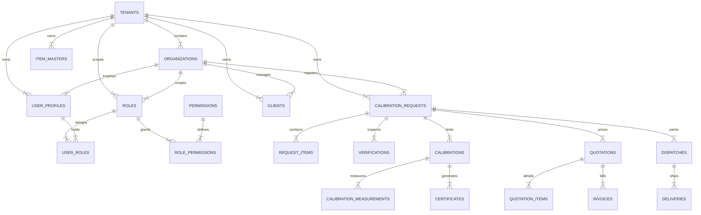

# Nethra CCM — Technical Architecture & System Design

> **Document Version:** 2.0  
> **Project URL:** `https://zwrbhnsfqapbritnqswe.supabase.co`  
> **Core Architecture:** React 19 + TypeScript + TanStack Query + Tailwind CSS + Supabase (PostgreSQL with RLS & RPCs)

---

## 1. System Architecture Overview

```mermaid
graph TD
    Client[React 19 SPA - Glassmorphism UI] --> Router[React Router v7 / Dynamic Guards]
    Router --> QueryEngine[TanStack Query Engine]
    QueryEngine --> Services[Typed Service Layer]
    Services --> SupabaseClient[Supabase JS Client]
    
    subgraph Supabase Cloud Instance (zwrbhnsfqapbritnqswe)
        SupabaseClient --> Auth[Supabase Auth Engine]
        SupabaseClient --> PostgREST[PostgREST Data API]
        PostgREST --> RLS[PostgreSQL Row Level Security Engine]
        RLS --> Tables[Database Tables (Triple-Key Linked)]
        PostgREST --> RPC[PostgreSQL RPC Store Functions]
        RPC --> Triggers[Audit & State Machine Triggers]
    end
```

---

## 2. Entity Relationship Diagram (ERD)



---

## 3. Triple-Key Process Traceability Pattern

Every operational table in Nethra CCM enforces 100% data isolation and auditing by maintaining three non-null or linked columns:

1. **`tenant_id`**: Identifies the primary enterprise tenant account.
2. **`organization_id`**: Identifies the specific sub-branch / lab facility under the tenant.
3. **`request_id`**: Identifies the core Calibration Intake Request lifecycle instance.

```sql
CREATE TABLE verifications (
    id UUID PRIMARY KEY DEFAULT gen_random_uuid(),
    tenant_id UUID NOT NULL REFERENCES tenants(id) ON DELETE CASCADE,
    organization_id UUID NOT NULL REFERENCES organizations(id) ON DELETE CASCADE,
    request_id UUID NOT NULL REFERENCES calibration_requests(id) ON DELETE CASCADE,
    request_item_id UUID NOT NULL REFERENCES request_items(id) ON DELETE CASCADE,
    verified_at TIMESTAMPTZ NOT NULL DEFAULT NOW(),
    verified_quantity INT NOT NULL,
    expected_quantity INT NOT NULL,
    observed_item_condition VARCHAR(50) NOT NULL,
    result VARCHAR(50) NOT NULL CHECK (result IN ('VERIFIED', 'DISCREPANCY', 'REJECTED')),
    discrepancy_reason TEXT,
    remarks TEXT,
    created_at TIMESTAMPTZ NOT NULL DEFAULT NOW()
);
```

---

## 4. Multi-Tenant Security Model (RLS & RPCs)

### PostgreSQL Row Level Security (RLS) Policy Pattern
All queries execute through standard PostgreSQL RLS policies that verify caller identity using `auth.uid()` mapped against `user_profiles`:

```sql
CREATE POLICY "Tenant and Org Isolation Select Policy"
ON verifications FOR SELECT TO authenticated
USING (
    tenant_id = (SELECT tenant_id FROM user_profiles WHERE id = auth.uid())
    AND (
        organization_id = (SELECT organization_id FROM user_profiles WHERE id = auth.uid())
        OR EXISTS (
            SELECT 1 FROM user_roles ur
            JOIN roles r ON ur.role_id = r.id
            WHERE ur.user_id = auth.uid() AND r.code = 'SUPER_ADMIN'
        )
    )
);
```

---

## 5. Component & Folder Architecture

```
react-supabase-ccm/src/
├── components/
│   ├── admin/                # Super Admin Governance UI (Container/Presenter/View)
│   ├── commercial/           # Quotation, PO, Invoices UI
│   ├── logistics/            # Gate Pass & Delivery UI
│   ├── operations/           # Intake Request UI
│   ├── lab/                  # Lab Inspection & Calibration UI
│   └── ui/                   # Glassmorphic UI Primitives
├── contexts/
│   └── AuthContext.tsx       # Auth & Profile Context
├── hooks/                    # TanStack Query Hooks
│   ├── useAuthContext.ts
│   ├── useCommercial.ts
│   ├── useExecution.ts
│   ├── useMasterData.ts
│   ├── useOperations.ts
│   ├── useRoles.ts
│   └── useRoleTemplates.ts
├── lib/
│   └── supabaseClient.ts     # Supabase Client Singleton
├── pages/                    # 100% Full-Page Route Components
├── routes/
│   ├── index.tsx             # Main Route Hierarchy
│   └── RouteGuards.tsx       # ProtectedRoute & PermissionRoute Guards
├── services/                 # API / Supabase Service Layer
└── types/                    # Domain Type Specifications
```
