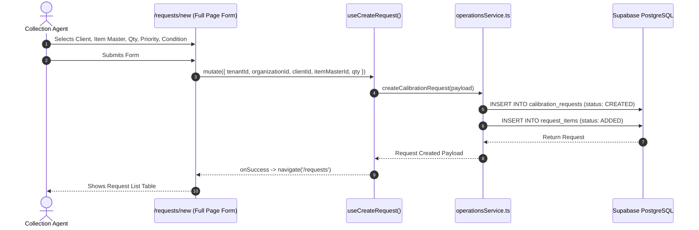
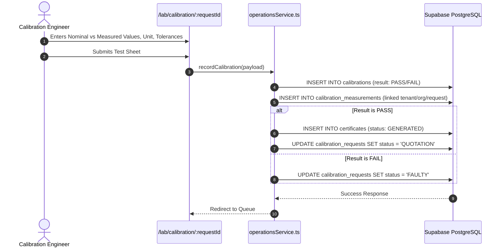
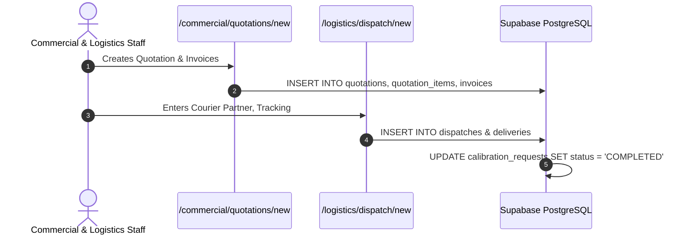

# Nethra CCM — Detailed Workflow Sequence Diagrams

---

## 1. Process 1: Equipment Intake Request Sequence

---

## 2. Process 2 & 3: Lab Verification & Metrology Calibration Sequence

---

## 3. Process 4 & 5: Commercial & Gate Pass Dispatch Sequence

